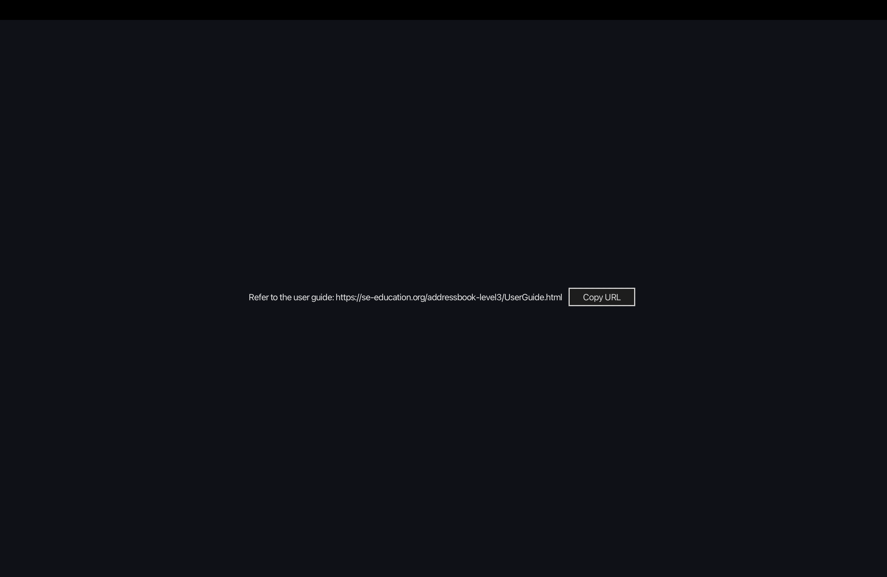
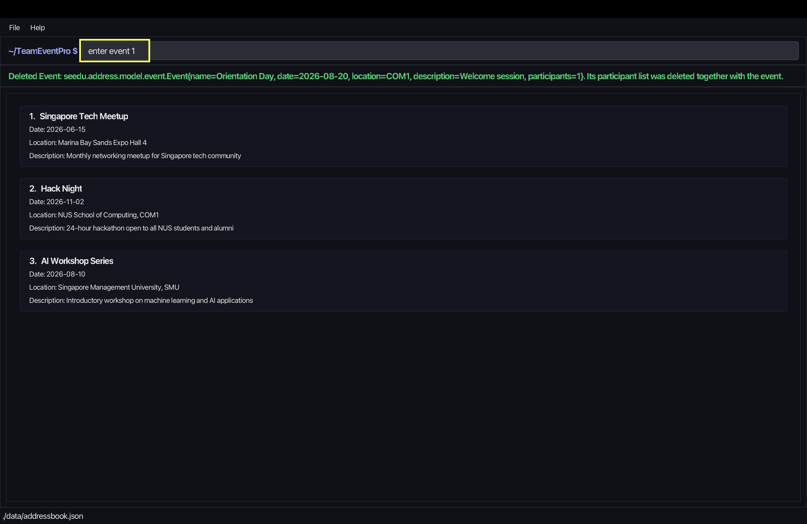
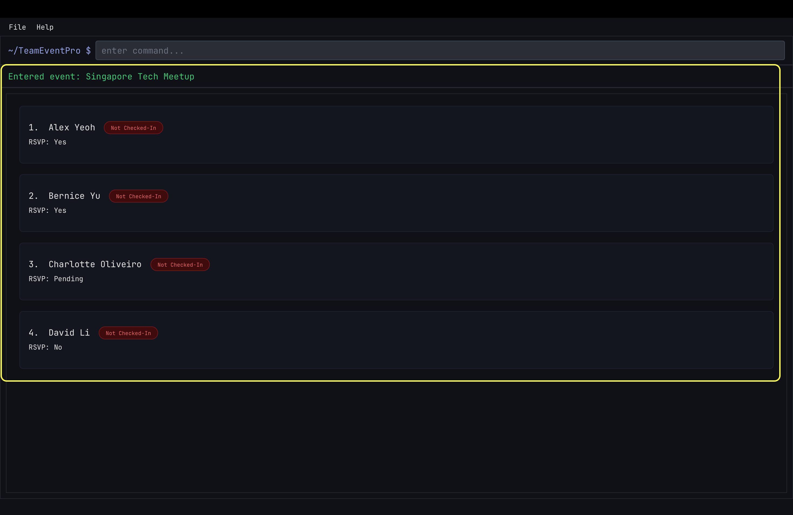
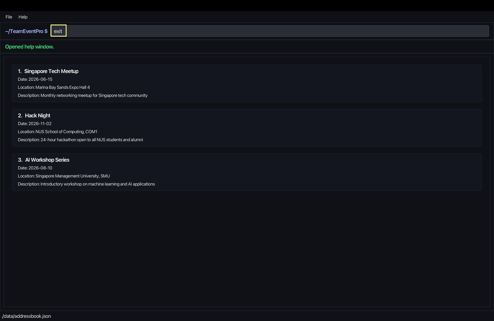
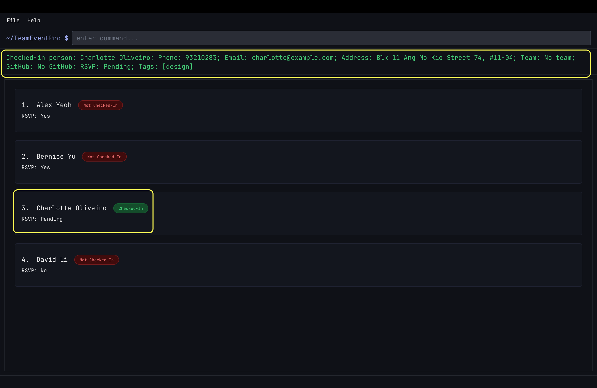
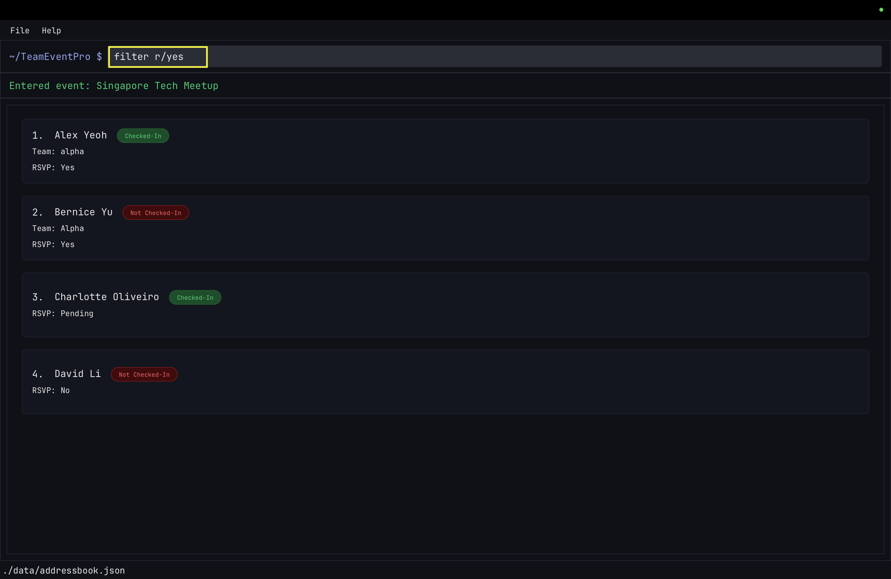
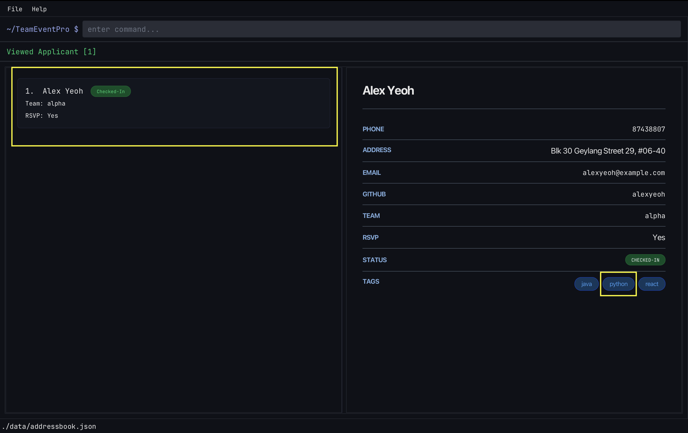
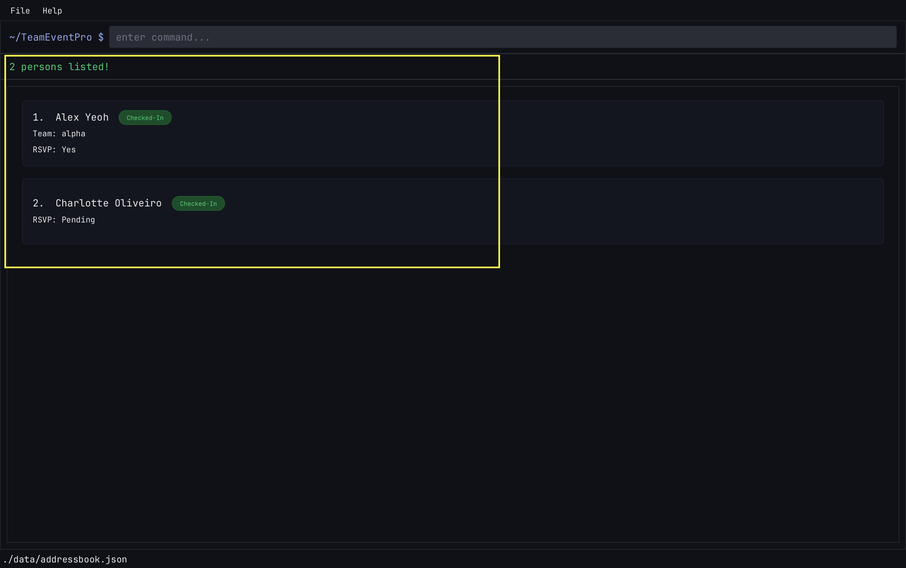
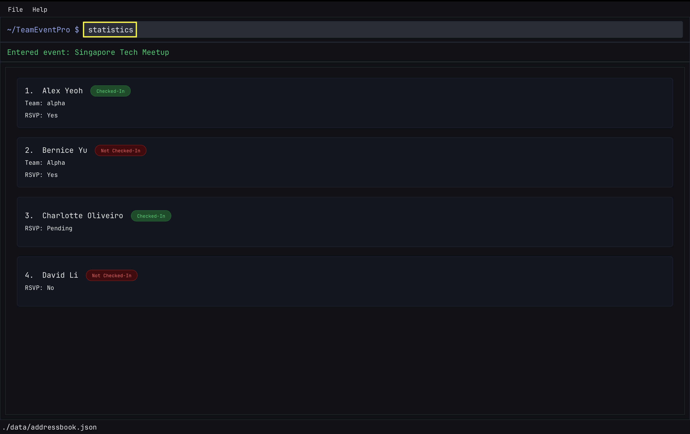

# TeamEventPro User Guide

## Guide Contents

- [About TeamEventPro](#1-about-teameventpro)
- [Getting Started](UserGuideGettingStarted.md)
- [Command Fundamentals](UserGuideCommandFundamentals.md)
- [Common Commands](UserGuideCommonCommands.md)
  - [Help : `help`](UserGuideCommonCommands.md#2-help-command)
  - [List : `list`](UserGuideCommonCommands.md#3-list-command)
  - [Search : `search`](UserGuideCommonCommands.md#4-search-command)
  - [Switch Mode : `switchmode`](UserGuideCommonCommands.md#5-switch-mode-command)
- [Event Commands](UserGuideEvents.md)
  - [Add Event : `addevent`](UserGuideEvents.md#11-add-event-command)
  - [Edit Event : `editevent`](UserGuideEvents.md#21-edit-event-command)
  - [Delete Event : `deleteevent`](UserGuideEvents.md#22-delete-event-command)
  - [Enter Event : `enter event`](UserGuideEvents.md#31-enter-event-command)
  - [Exit : `exit`](UserGuideEvents.md#41-exit-command)
- [Participant Commands](UserGuideParticipants.md)
  - [Add Participant : `add`](UserGuideParticipants.md#11-add-command)
  - [Edit Participant : `edit`](UserGuideParticipants.md#12-edit-command)
  - [Delete Participant : `delete`](UserGuideParticipants.md#13-delete-command)
  - [Clear Participants : `clear`](UserGuideParticipants.md#14-clear-command)
  - [Assign Team : `assign`](UserGuideParticipants.md#21-assign-team-command)
  - [Check-In : `checkin`](UserGuideParticipants.md#22-check-in-command)
  - [Filter : `filter`](UserGuideParticipants.md#31-filter-command)
  - [View Participant : `view`](UserGuideParticipants.md#32-view-command)
  - [Statistics : `statistics`](UserGuideParticipants.md#33-statistics-command)
  - [Import : `import`](UserGuideParticipants.md#41-import-command)
  - [Export : `export`](UserGuideParticipants.md#42-export-command)
  - [Leave Event : `leave event`](UserGuideParticipants.md#51-leave-event-command)

---

## 1. About TeamEventPro

TeamEventPro is a desktop application designed to help users manage events and participants efficiently. It is intended for users who prefer typing commands over navigating through menus, allowing them to perform tasks quickly and consistently.

The application supports two main workflows. First, users can manage events by creating, editing, deleting, searching for, and entering events. Second, once inside an event, users can manage participants by adding or editing their details, assigning teams, checking attendance, viewing statistics, and importing or exporting participant data.

TeamEventPro provides the speed of a Command Line Interface (CLI) while still offering the visual clarity of a Graphical User Interface (GUI). This makes it suitable for users who want a structured and efficient way to handle event and participant management in a single application.

---

## 2. Understanding App Modes

TeamEventPro has two main modes of use.

### 2.1 Outside an event

In this mode, you are viewing and managing the list of events.

You can use this mode to:
- create events
- edit event details
- delete events
- search for events
- enter a specific event

Full details for these commands are in [Event Commands](UserGuideEvents.md).

### 2.2 Inside an event

In this mode, you are managing participants within a selected event.

You can use this mode to:
- add, edit, and delete participants
- assign participants to teams
- check in participants
- filter and view participant details
- view event statistics
- import and export participant data
- leave the current event and return to the event list

Full details for these commands are in [Participant Commands](UserGuideParticipants.md).

## 3. Commands Available in Both Modes

The following commands can be used regardless of whether you are inside or outside an event:

- `help`
- `list`
- `search`
- `switchmode`

Full details for these commands are in [Common Commands](UserGuideCommonCommands.md).

---

## 4. Next Sections

- [Getting Started](UserGuideGettingStarted.md)
- [Common Commands](UserGuideCommonCommands.md)
- [Command Fundamentals](UserGuideCommandFundamentals.md)
- [Event Commands](UserGuideEvents.md)
- [Participant Commands](UserGuideParticipants.md)

---

# Getting Started

This page helps you install TeamEventPro, launch it, and complete your first workflow.

---

## 1. Prerequisites

- Install Java `17` or above.
- Ensure your terminal can run `java -version`.

For macOS-specific setup guidance, follow the prescribed JDK instructions in the project docs.

---

## 2. Install and launch

1. Download the latest TeamEventPro `.jar` from the release page.
2. Place the `.jar` file in your preferred working folder.
3. Open a terminal in that folder.
4. Run:

   `java -jar addressbook.jar`

5. Wait for the application window to open.

---

## 3. First-time setup

- On first launch, complete the onboarding tutorial.
- Use the command box at the bottom of the app to run commands.
- Press Enter after each command.

---

## 4. Where to go next

- For shared command conventions, prefix usage, and index/list behavior, see [Command Fundamentals](UserGuideCommandFundamentals.md).
- View global commands in [Common Commands](UserGuideCommonCommands.md).
- View mode-specific command details in [Event Commands](UserGuideEvents.md) and
  [Participant Commands](UserGuideParticipants.md).

---

## 5. Navigation

- [Back to Introduction and App Modes](UG.md)
- [Go to Command Fundamentals](UserGuideCommandFundamentals.md)
- [Go to Common Commands](UserGuideCommonCommands.md)
- [Go to Event Commands](UserGuideEvents.md)
- [Go to Participant Commands](UserGuideParticipants.md)

---

# Command Fundamentals

This page is the shared conventions reference for how commands are written and interpreted across TeamEventPro.
Read this once before using [Event Commands](UserGuideEvents.md) or [Participant Commands](UserGuideParticipants.md).

---

## 1. Command Notation

- Words in `UPPER_CASE` are parameters to be supplied by the user.
- Items followed by `...` can be used multiple times.
- For prefixed arguments, parameter order usually does not matter unless stated otherwise.
- Indexes refer to the numbers shown in the displayed list.
- Dates should follow the format `YYYY-MM-DD`.

---

## 2. Command Structure and Modes

TeamEventPro operates in two modes:
- **Outside an event**: event-level commands such as `addevent`, `editevent`, `deleteevent`, `enter event`, `list`, `search`.
- **Inside an event**: participant-level commands such as `add`, `edit`, `delete`, `assign`, `filter`, `checkin`, `view`, `statistics`, `list`, `search`, `leave event`.

Most commands follow one of these patterns:
- `COMMAND [INDEX] [PREFIX/VALUE]...`
- `COMMAND KEYWORD INDEX` (example: `enter event 1`)
- `COMMAND` (example: `list`, `help`, `statistics`)

---

## 3. Prefix Reference

| Prefix | Field | Accepts | Does not accept |
| --- | --- | --- | --- |
| `n/` | Name | Alphanumeric characters, spaces, hyphens (`-`), slashes (`/`), and apostrophes (`'`), e.g. `n/John Doe`, `n/John-Doe`, `n/John/Ong`, `n/John O'Neil` | Other special characters (for example `@`, `#`, `%`, `!`) |
| `p/` | Phone | Digits only, at least 3 digits, e.g. `p/98765432` | Letters/symbols, e.g. `p/98A76`, `p/+6598765432` |
| `e/` | Email | Standard email format, e.g. `e/john@example.com` | Missing `@` or invalid format, e.g. `e/johnexample.com` |
| `a/` | Address | Free-text address, e.g. `a/311 Clementi Ave 2` |  |
| `tm/` | Team (`add`/`edit`) | Alphanumeric team name, 1-15 chars, e.g. `tm/Alpha7` | Spaces/symbols/too-long text, e.g. `tm/Alpha Team`, `tm/Alpha-1` |
| `team/` | Team (`assign`/`filter`) | Alphanumeric team name, 1-15 chars, e.g. `team/Alpha7` | Using `tm/` in `assign`/`filter`; invalid team format |
| `g/` | GitHub username | GitHub-style username, e.g. `g/johndoe`, `g/john-doe` | Leading/trailing hyphen, spaces, e.g. `g/-john`, `g/john-`, `g/john doe` |
| `r/` | RSVP status | `yes`, `no`, `pending` | Any other value, e.g. `r/maybe` |
| `t/` | Tag | Alphanumeric tag, repeatable, e.g. `t/python t/ml` | Symbols/spaces, e.g. `t/machine-learning`, `t/data science` |
| `d/` | Event date | `YYYY-MM-DD`, e.g. `d/2026-10-03` | Invalid date format, e.g. `d/03-10-2026` |
| `l/` | Event location | Optional free text, e.g. `l/NUS COM1` |  |
| `desc/` | Event description | Optional free text, e.g. `desc/Weekly meetup` |  |
| `checkin/` | Check-in filter status | `yes`, `no` | Any other value, e.g. `checkin/maybe` |

For required fields, an empty prefix value is invalid unless explicitly stated otherwise.
Use the exact prefix expected by each command. Prefixes are not interchangeable.

---

## 4. Index and List Behavior

- Commands with `INDEX` use the index from the currently displayed list.
- If the list is filtered, the index refers to the filtered results, not the full list.
- After `search` or `filter`, always re-check the visible indexes before running `edit`, `delete`, `checkin`, `assign`, or `view`.

Example:
1. `filter r/yes`
2. `checkin 2`

The command applies to item `2` in the filtered list, not item `2` from an earlier unfiltered list.

---

## 5. Common Mistakes and Quick Fixes

- Missing required prefix (for example, no `e/` in `add`) -> include all required prefixes.
- Invalid index -> ensure index is a positive integer within the displayed list range.
- Wrong team prefix -> use `tm/` for `add` and `edit`, and `team/` for `assign` and `filter`.
- Invalid RSVP value -> use only `yes`, `no`, or `pending`.
- Multiple filter criteria in one command -> use exactly one filter criterion per `filter` command.
- Using command in wrong mode -> use event commands outside an event, and participant commands inside an event.

If a command fails with format errors, copy the exact `Format` block from the relevant command page and retry.

---

## 6. Navigation

- [Back to Introduction, Modes, and Common Commands](UG.md)
- [Back to Common Commands](UserGuideCommonCommands.md)
- [Go to Event Commands](UserGuideEvents.md)
- [Go to Participant Commands](UserGuideParticipants.md)

---

# Common Commands

This page describes commands that are available in both app modes.

---

## 1. Commands Available in Both Modes

The following commands can be used regardless of whether you are inside or outside an event:

- `help`
- `list`
- `search`
- `switchmode`

---

## 2. Help Command

Used to open the help window and view usage instructions.

### Format
`help`

### Example Usage
```
help
```


### Successful Execution
Opens a new window containing the User Guide link.



### Notes
- Can be used in any mode.

---

## 3. List Command

Used to list all events or all participants depending on the current mode.

### Format
`list`

### Example Usage
`list`

### Successful Execution
- Outside an event: `Listed all events`
- Inside an event: `Listed all participants`

### Notes
- Works differently depending on the current mode.

---

## 4. Search Command

Used to search for matching events or participants depending on the current mode.

### Format
`search [KEYWORD]...`

### Example Usage
`search meetup workshop`

### Successful Execution
- Outside an event: matching events are shown in the event list.
- Inside an event: matching participants are shown in the participant list.

### Notes
- Can be used in any mode.
- The results depend on the current mode.

---

## 5. Switch Mode Command

Used to switch the application theme.

### Format
`switchmode [dark|light]`

### Example Usage
`switchmode dark`

### Successful Execution
`Switched to dark mode.`

### Notes
- Can be used in any mode.
- Only `dark` and `light` are valid values.

---

## 6. Navigation

- [Back to Introduction and App Modes](UG.md)
- [Go to Event Commands](UserGuideEvents.md)
- [Go to Participant Commands](UserGuideParticipants.md)

---

# Event Commands

This page describes commands that are primarily used while you are outside an event and managing the event list.

---

## 1. Event Creation and Setup

### 1.1 Add Event Command

Used to add an event to the event list by specifying the name, date, and optional details such as location and description.

#### Format
`addevent n/[EVENT NAME] d/[DATE] [l/LOCATION] [desc/DESCRIPTION]`

#### Example Usage
`addevent n/Tech Meetup 2026 d/2026-06-15 l/NUS Techno Edge desc/Annual tech networking session`

#### Successful Execution
`New event added: ...`

#### Notes
- Can only be used outside an event.
- Event name should be concise.
- Date must follow `YYYY-MM-DD`.
- Location and description are optional.

---

## 2. Event Maintenance

### 2.1 Edit Event Command

Used to edit the details of an existing event in the event list.

#### Format
`editevent [INDEX] [n/EVENT NAME] [d/DATE] [l/LOCATION] [desc/DESCRIPTION]`

#### Example Usage
`editevent 1 n/Hack Night d/2026-08-20 l/NUS COM1 desc/Bring your laptop`

#### Successful Execution
`Edited Event: ...`

#### Notes
- Can only be used outside an event.
- Index must be a positive integer.
- At least one field to edit must be provided.
- Location can be cleared with `l/`.
- Description can be cleared with `desc/`.

### 2.2 Delete Event Command

Used to delete an event from the event list. The participant list stored under that event is deleted together with it.

#### Format
`deleteevent [INDEX]`

#### Example Usage
`deleteevent 1`

#### Successful Execution
`Deleted Event: ... Its participant list was deleted together with the event.`

#### Notes
- Can only be used outside an event.
- Index must be a positive integer.
- Use this command carefully because the event's participant list is also removed.

---

## 3. Event Navigation

### 3.1 Enter Event Command

Used to enter an event and switch into participant-management mode for that event.

#### Format
`enter event [INDEX]`

#### Example Usage
```
enter event 1
```


#### Successful Execution



#### Notes
- Can only be used outside an event.
- Index must be a positive integer.
- You must leave the current event before entering another one.

---

## 4. Application Exit

### 4.1 Exit Command

Used to close the application.

#### Format
`exit`

#### Example Usage
```
exit
```


#### Successful Execution
The application is exited.

#### Notes
- This command only succeeds outside an event.
- If you are currently inside an event, leave it first before exiting.

---

## 5. Navigation

- [Back to Introduction, Modes, and Common Commands](UG.md)
- [Back to Common Commands](UserGuideCommonCommands.md)
- [Back to Command Fundamentals](UserGuideCommandFundamentals.md)
- [Go to Participant Commands](UserGuideParticipants.md)

---

# Participant Commands

This page describes commands that are used while you are inside an event and managing that event's participants.

See [Command Fundamentals](UserGuideCommandFundamentals.md) for command syntax, prefix rules, index behavior, and common input mistakes.

---

## 1. Participant Management

### 1.1 Add Command

Used to add a participant to the currently entered event.

#### Format
`add n/[NAME] p/[PHONE] e/[EMAIL] a/[ADDRESS] [tm/TEAM] [g/GITHUB_USERNAME] [r/RSVP_STATUS] [t/TAG]...`

#### Example Usage
`add n/John Doe p/98765432 e/johnd@example.com a/311, Clementi Ave 2, #02-25 tm/Development g/johndoe r/yes t/friends`

#### Successful Execution
`New applicant added: ...`

#### Notes
- Can only be used inside an event.
- Name, phone, email, and address are required.
- `RSVP_STATUS` must be `yes`, `no`, or `pending`.
- Team names must be alphanumeric and at most 15 characters.

### 1.2 Edit Command

Used to edit the details of an existing participant in the current event.

#### Format
`edit [INDEX] [n/NAME] [p/PHONE] [e/EMAIL] [a/ADDRESS] [g/GITHUB_USERNAME] [r/RSVP_STATUS] [tm/TEAM] [t/TAG]...`

#### Example Usage
`edit 1 p/91234567 e/johndoe@example.com`

#### Successful Execution
`Edited Participant: ...`

#### Notes
- Can only be used inside an event.
- Index must be a positive integer.
- At least one field to edit must be provided.

### 1.3 Delete Command

Used to delete a participant from the current event.

#### Format
`delete [INDEX]`

#### Example Usage
`delete 1`

#### Successful Execution
`Deleted Participant: ...`

#### Notes
- Can only be used inside an event.
- Index must be a positive integer.

### 1.4 Clear Command

Used to clear all participants from the current event.

#### Format
`clear`

#### Example Usage
`clear`

#### Successful Execution
`Address book has been cleared!`

#### Notes
- Can only be used inside an event.
- This removes all participants from the current event.

---

## 2. Team and Attendance Management

### 2.1 Assign Team Command

Used to assign a participant to a team.

#### Format
`assign [INDEX] team/[TEAM NAME]`

#### Example Usage
`assign 2 team/Alpha`

#### Successful Execution
`Assigned ... to Team Alpha.`

#### Notes
- Can only be used inside an event.
- Index must be a positive integer.
- Team names should be concise and valid according to app rules.

### 2.2 Check-In Command

Used to mark a participant as checked in.

#### Format
`checkin [INDEX]`

#### Example Usage
```
checkin 3
```


#### Successful Execution



#### Notes
- Can only be used inside an event.
- Index must be a positive integer.

---

## 3. Search, Filtering, and Viewing

### 3.1 Filter Command

Used to filter the participant list using one criterion at a time.

#### Format
<tabs>
<tab header="RSVP">

`filter r/[RSVP_STATUS]`

</tab>
<tab header="Tag">

`filter t/[TAG]`

</tab>
<tab header="Team">

`filter team/[TEAM NAME]`

</tab>
<tab header="Check-in">

`filter checkin/[yes|no]`

</tab>
</tabs>

#### Example Usage
<tabs>
<tab header="RSVP">

```
filter r/yes
```


</tab>
<tab header="Tag">

```
filter t/python
```


</tab>
<tab header="Team">

```
filter team/Alpha
```


</tab>
<tab header="Check-in">

```
filter checkin/yes
```


</tab>
</tabs>

#### Successful Execution
<tabs>
<tab header="RSVP">


</tab>
<tab header="Tag">



</tab>
<tab header="Team">


</tab>
<tab header="Check-in">



</tab>
</tabs>

#### Notes
- Can only be used inside an event.
- Supported prefixes are `r/`, `t/`, `team/`, and `checkin/`.
- Only one filter criterion can be used per command (e.g., `filter r/yes t/python` is invalid).
- Filtering is not cumulative across commands; each `filter` command replaces the previous filter/search.
- `checkin/` accepts `yes` or `no`(case-insensitive).

### 3.2 View Command

Used to show the details of a selected participant.

#### Format
```
view [INDEX]
```

#### Example Usage
```
view 1
```


#### Successful Execution


#### Notes
- This command can only be used inside an event.
- `INDEX` must be a positive integer.
- The `INDEX` must refer to a participant currently shown in the displayed list, including filtered or searched results.
- The command fails if the `INDEX` is invalid or out of range.

### 3.3 Statistics Command

Used to display the current event's participant statistics summary.

#### Format
```
statistics
```

#### Example Usage
```
statistics
```


#### Successful Execution


#### Notes
- Can only be used inside an event.
- This is a read-only command; it does not edit participant data.
- If you want to return to normal participant list operations, use commands like `list`, `filter`, `search`, etc.
- The command format is `statistics` only (no index or prefixes needed).

---

## 4. Import and Export

### 4.1 Import Command

Used to import participants from a CSV file into the current event.

#### Format
`import [FILE_PATH]`
`import list`

#### Example Usage
`import data/participants.csv`

#### Successful Execution
Participants from the CSV file are imported into the current event. Invalid rows and duplicates are skipped and reported.

#### Notes
- Can only be used inside an event.
- Only `.csv` files are supported.
- `import list` shows discoverable CSV files.
- Required CSV headers are `name`, `phone`, `email`, and `address`.

### 4.2 Export Command

Used to export participants from the current event to a CSV file.

#### Format
`export [FILE_PATH]`

#### Example Usage
`export data/exports/team-event.csv`

#### Successful Execution
`Exported ... participant(s) to ...`

#### Notes
- Can only be used inside an event.
- Only `.csv` files are supported.
- If no file path is provided, the default export path is used.
- If the target file already exists, the app exports to a timestamped file instead.

---

## 5. Event Navigation

### 5.1 Leave Event Command

Used to leave the current event and return to the event list.

#### Format
`leave event`

#### Example Usage
```
leave event
```


#### Successful Execution


#### Notes
- Can only be used inside an event.
- Ensure that there is no space after `event`.

---

## 6. Navigation

- [Back to Introduction, Modes, and Common Commands](UG.md)
- [Back to Common Commands](UserGuideCommonCommands.md)
- [Back to Command Fundamentals](UserGuideCommandFundamentals.md)
- [Back to Event Commands](UserGuideEvents.md)
